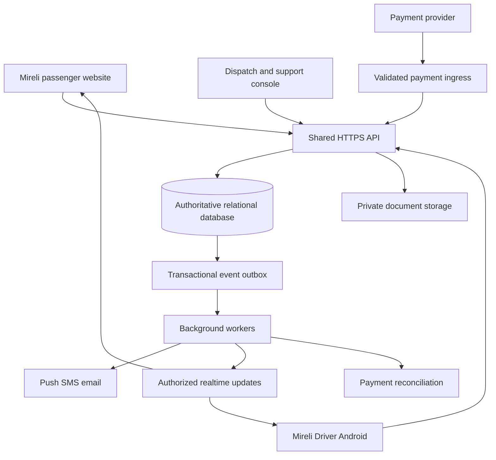

# Mireli Driver — product, engineering, compliance and release master plan

**Prepared:** 1 October 2026  
**Status:** Implementation blueprint; no application has been built or certified by this document.  
**Audience:** Mireli owner, Android and web developers, designer, dispatch team, QA, accountant and Kenyan legal adviser.  
**Objective:** Build and operate an Android driver app connected to the existing Mireli passenger website, supporting individual seat reservations and private charters for the Mombasa SGR travel niche, then release it through Google Play with documented operational and compliance readiness.

## 1. What we know, what we assume, and the main recommendation

### Confirmed context

- Mireli already has a passenger website for individual seat bookings and charters, according to the owner.
- This project is the driver-facing Android application.
- The intended market is SGR-related rides to and from Mombasa.
- Uber and Bolt are usability references. Mireli needs its own identity, workflows, assets and commercial terms.
- The local `mireli driver` workspace was empty when inspected. No source code, backend configuration, website URL, database schema or existing integration was available to audit.

### Working assumptions, pending discovery

The initial service is scheduled road transfers between the Mombasa SGR terminus and supported local destinations, in both directions. Individual passengers can buy seats in a shared vehicle; a charter reserves a whole vehicle. The exact routes, station access arrangements, fleet ownership and driver employment model remain unknown. Long-distance road journeys require an additional operating and licensing assessment before being included.

This plan does not assume that Mireli sells rail tickets, has a Kenya Railways partnership, has access to a train-status API, or owns a licensed transport fleet. Station names, maps, train information and commercial permissions must be verified.

### Recommended structure

**Use one authoritative booking and operations backend shared by Mireli Web, Mireli Driver and a dispatch/admin console.** The applications are different interfaces to the same business records. They should not each maintain an independent book of available seats, payment truth or driver assignments.

Prefer extending the existing website backend if it can securely support these responsibilities. Select the Android framework after inspecting that system and the team's skills. The provisional Android-first recommendation is Kotlin with Jetpack Compose; this is an engineering choice, not a prerequisite for Google Play.

The first launch should use scheduled trips and dispatcher-controlled assignment. Automated ride matching, surge pricing, an internal wallet and machine-learning dispatch can wait. The system must still handle cancellations, refunds, document expiry, weak connectivity and human support from the first real passenger journey.

### How to read this plan

- **Proposed:** A product or engineering decision to validate during discovery.
- **Policy baseline:** A requirement supported by the linked official source, checked during this planning session.
- **Legal applicability review:** A matter that depends on Mireli's actual business model and must be resolved with the responsible Kenyan professional or authority.
- **Release gate:** Evidence required before launch; an unchecked box is not proof of compliance.

This document is a requirements and delivery plan, not a legal opinion or a guarantee of store approval. Current rules and their applicability must be checked again at submission and before commercial operation.

## 2. Contents and delivery map

1. Context and recommendations
2. Contents and delivery map
3. Product scope and success criteria
4. Passenger website discovery and integration
5. Service rules and scheduling
6. Driver experience and UI specification
7. Dispatch, support and finance console
8. Architecture and technology decisions
9. Data model and consistency rules
10. API and event contracts
11. Booking, assignment and trip state machines
12. Payments, refunds and driver settlements
13. Location, maps and Android permissions
14. Offline operation and notifications
15. Identity, access control and security
16. Privacy and data lifecycle
17. Kenyan legal and operational readiness
18. Google Play readiness
19. Infrastructure, deployment and observability
20. Testing and release evidence
21. Delivery phases and implementation backlog
22. Ownership, budget and risks
23. Launch checklist and first-month operations
24. Outstanding decisions
25. Official references

## 3. Product scope and success criteria

### 3.1 Users and responsibilities

| Role | Primary needs | Boundaries |
|---|---|---|
| Passenger, on Mireli Web | Book, pay, find pickup, see assigned driver, receive changes, cancel and request support | Sees only their own booking and permitted tracking |
| Driver | See assigned work, acknowledge it, navigate, verify boarding, finish journeys, see earnings and request help | Cannot change fares, invent payment success or browse all passengers |
| Dispatcher | Schedule departures, allocate compliant drivers/vehicles, manage delays and recover failed trips | Overrides require reasons and audit records |
| Operations/compliance staff | Verify documents, handle expiry, approve vehicles and investigate incidents | Sensitive document access is restricted |
| Finance | Reconcile payments, approve refunds, settle driver balances and export accounts | Separate permissions from driver approval and general support |
| Support | Resolve passenger/driver problems with minimum necessary context | No unrestricted ID-document or payout access |
| Business administrator | Manage configuration, staff access and commercial policies | Strong authentication and audited changes |

### 3.2 Launch scope

**Driver app:** invitation or application onboarding; verified phone; document status; vehicle selection where authorized; availability; upcoming assignments; acknowledgement; pickup instructions; passenger manifest; boarding verification; active-trip tracking; multi-stop progress; completion; earnings statement; support; incident reporting; privacy and deletion request.

**Shared platform:** routes and departures; seat inventory; exclusive charter inventory; payment verification; dispatch; customer notifications; cancellation/refund handling; document expiry; audit records; operational dashboards; backups and incident response.

**Website changes:** common booking IDs and states, accurate remaining capacity, shared payment status, driver/vehicle details, tracking with expiry, pickup guidance, change notices, cancellation/refund visibility, consistent legal documents.

**Deferred:** passenger mobile app, unrestricted nationwide hailing, dynamic pricing, loyalty, referral credits, stored-value wallet, automated facial recognition, dashcam recording, complex bidding and automatic disciplinary decisions. Each would add separate product, safety, privacy or regulatory work.

### 3.3 Acceptance outcomes

1. A passenger makes a website booking and it appears once in dispatch and in the correct driver's authorized manifest.
2. Two customers competing for the last seat cannot both receive confirmed reservations.
3. A charter blocks the entire assigned vehicle for the relevant time interval and prevents conflicting shared departures.
4. M-Pesa success, failure, delay, duplicate callbacks, late settlement and refunds have traceable outcomes.
5. Passenger-visible trip status follows server-accepted driver actions and shows when information is stale.
6. Losing network connectivity does not silently lose boarding or completion actions.
7. A suspended driver or expired vehicle cannot receive new work through an API bypass.
8. A driver cannot access another driver's trip or another operator's documents by changing an identifier.
9. Support can recover a breakdown or driver no-show using an audited procedure.
10. The signed production build passes real-device field testing and Play review, and the business has completed applicable operational approvals.

## 4. Connect Mireli Driver to Mireli Web

### 4.1 Discovery before implementation

Obtain the website URL, repository access and a staging environment. Do not request passwords in chat; use invited accounts and a secret manager for credentials.

Inventory:

- Frontend framework, backend framework, hosting, deployment method and repository owner.
- Database technology, booking/seat tables, existing passenger accounts and identifiers.
- Payment provider, merchant ownership, callbacks, refunds, receipt numbering and reconciliation.
- Current handling of scheduled departures, charters, capacity, cancelled bookings and failed payments.
- Authentication, staff roles, logging, backups, privacy notices and customer terms.
- Existing APIs, webhooks, queues, SMS/email integrations and operational spreadsheets.
- Traffic peaks, current booking volume, historical incidents and expected launch fleet.

Produce a short system map, data dictionary and gap list. A functioning checkout page is not enough evidence that the backend safely controls shared inventory.

### 4.2 Integration options

| Existing website situation | Recommended action | Main condition |
|---|---|---|
| Owned backend with usable business logic | Extend it with driver/admin APIs and event delivery | Keep one authoritative booking write path |
| Managed platform with suitable APIs/webhooks | Build an integration adapter and establish record ownership | Verify atomic inventory control and financial reconciliation |
| Frontend or form-only site | Introduce a shared backend and connect both clients | Website booking flow must use its server-side inventory |
| Separate legacy booking system that must stay | Use an anti-corruption adapter, ID mapping and reconciliation | Do not let two systems independently sell the same capacity |

**No direct mobile database access. No scraping the website as the integration. No periodic CSV export as the live booking channel.** If the existing platform cannot reserve inventory atomically, replace that specific write path before simultaneous sales are enabled.

### 4.3 Target topology



The diagram is logical: a small launch can run the API and workers from one modular codebase. A message broker or separate realtime service is optional; reliable database transactions and durable jobs are not.

### 4.4 Reference journey

1. Website asks the API for departures and a server-calculated quote.
2. API atomically holds the requested seats for a short configured period.
3. Payment is initiated server-side using that booking and amount.
4. Verified provider evidence produces the accepted financial result.
5. In one database transaction, the system confirms eligible inventory and records an outbox event.
6. Dispatcher assigns an eligible vehicle and driver, or an existing assignment's manifest updates.
7. Driver receives a notification and fetches current server state.
8. Driver acknowledges the assignment; the website receives permitted driver and vehicle details.
9. Boarding records update the passenger journey without revealing other passengers.
10. Trip progress, completion, refunds and settlement use the same IDs across all channels.

A booking can be confirmed before driver assignment only if Mireli's published service policy and capacity commitment permit it. A request for a charter must not become a guaranteed confirmed ride while vehicle availability is still unknown.

### 4.5 Safe migration and cutover

- Back up the existing system and prove a restore before migrating live bookings.
- Map old IDs to canonical IDs; preserve original payment references and receipt history.
- Import a snapshot into staging; compare counts, money totals, passengers and capacity per departure.
- Run read-only shadow comparisons before changing the live website write path.
- Cut over a limited route or departure cohort using a feature flag and a documented ownership boundary.
- Avoid uncontrolled dual writes. Where event replication is needed, persist delivery state and use replay-safe consumers.
- Retain compatibility for old website sessions; identify how unfinished checkouts cross the cutover.
- Define rollback that stops new writes, reconciles records already created, and preserves accepted payments. Restoring an old database over new transactions is not an acceptable rollback.
- Obtain a live end-to-end booking/boarding/completion trace before extending the cohort.

## 5. Service rules and scheduling

### 5.1 Shared seats and charters

| Rule | Shared departure | Private charter |
|---|---|---|
| Commercial unit | Seat or group of seats | Exclusive vehicle and agreed itinerary |
| Capacity | Many bookings share one scheduled trip | All capacity committed to one charter |
| Price | Published per-seat or route-zone quote | Fixed approved quote, deposit/balance if offered |
| Dispatch | Assign driver/vehicle to departure | Reserve driver/vehicle for full service window |
| Boarding | Each booking/party reconciled | Lead contact plus passenger count/manifest as required |
| Cancellation | Release only cancelled capacity | Release exclusive reservation subject to agreed policy |
| Completion | Resolve each passenger's stop outcome | Resolve all contracted legs/stops |

Seat count is not the same as usable luggage capacity. Model luggage allowance, wheelchair/access requirements and equipment needs explicitly. Vehicle replacement must preserve the promised capacity and suitability or trigger a transparent recovery/refund process.

For launch, sell seats for the entire shared departure. If later selling overlapping route segments, enforce capacity on every occupied segment; a single trip-level seat counter would then be insufficient.

### 5.2 SGR-specific requirements

- Configure station, meeting point, pickup bay, landmark, coordinates and approved pickup instructions.
- Separate train arrival/departure time from transfer reporting time and road departure time.
- Store train-service references and schedule source where available, with a last-verified timestamp.
- Publish allowed pickup zones and avoid accepting any map point without a serviceability check.
- Support inbound train delays, passenger exit time, luggage collection, road traffic and station access restrictions.
- Define outbound train connection buffers with operations; do not promise a guaranteed connection without a supportable policy.
- Keep train updates manual and attributable until an authorized reliable integration exists.
- Model overnight dates and store UTC timestamps, displaying `Africa/Nairobi` local time.
- Let dispatch adjust a departure with a reason, impact preview and passenger notification.
- Define how shared trips behave when minimum occupancy is not reached; never silently cancel an accepted journey.
- Maintain standby vehicle/driver arrangements and a service-hours escalation contact.

### 5.3 Commercial configuration to approve

Create a versioned rules table for fare zones, seat capacity, luggage, deposits, waiting time, no-shows, refund eligibility, cancellation cutoffs, driver cancellation, route changes, parking charges, tolls and additional stops. Snapshot the accepted terms and quote on each booking so later price edits do not rewrite history.

Business must decide child seating and accompanied-minor rules, accessibility commitments, assistance animals, lost property and unsafe-passenger escalation with appropriate professional input. Do not let developers silently decide these policies.

## 6. Driver experience and UI specification

### 6.1 Design direction

Mireli should feel calm, clear and dependable in bright sunlight, on a phone mount and on modest Android hardware. The main screen should prioritize the next scheduled task, reporting time and readiness. An Uber-style map can support active navigation, but it should not displace the schedule and passenger manifest that this niche needs.

Use existing Mireli branding once supplied. Proposed tokens: a dark neutral for text, high-contrast light surfaces, one primary action color, and separate success/warning/error colors with text labels. Reuse a restrained set of cards, buttons, form fields, badges, bottom sheets and confirmation dialogs.

Design requirements:

- Minimum 48 dp interactive targets as a project standard; large critical controls.
- Readable type, scalable fonts, adequate contrast, TalkBack labels and logical focus order.
- Never encode payment, boarding or trip state through color alone.
- English and Kiswahili string resources; translations reviewed by fluent users.
- Localized phone entry, KES amounts and unambiguous date/time formatting.
- Low-data loading states, visible retries and a persistent stale/offline indicator.
- Support system navigation, display cutouts, font scaling, dark mode and screen rotation/layout changes where useful.
- Confirm consequential actions and explain server-rejected actions in plain language.
- Reduce interaction while moving; no mandatory typing, scanning or multi-step forms during driving.
- Use original licensed icons, photos, typography and illustrations. Do not copy competitor assets or branding.

### 6.2 Navigation

Proposed primary tabs: **Today**, **Trips**, **Earnings**, **Account**. Support is accessible from every active-trip screen. The active trip remains easy to return to after opening an external navigation application.

### 6.3 Screen specification

| Screen | Content and main action | Required alternative states |
|---|---|---|
| Launch/session recovery | Restore session and route to correct state | Expired session, service outage, required update |
| Welcome/sign in | Explain driver-only purpose; phone verification | Invalid phone, resend cooldown, delivery failure, recovery |
| Driver application/invitation | Minimum profile, agreement and document checklist | Saved draft, upload retry, unsupported file |
| Review status | Pending, approved or changes required with reason | Suspended, rejected, appeal/support route |
| Permissions explanation | Explain location and notifications at point of use | Denied, approximate-only, permanently denied |
| Today | Availability, vehicle, next assignment and report time | No trips, documents expiring, offline, outstanding action |
| Assignment detail | Stops, schedule, seats, luggage, earnings basis | Changed, withdrawn, conflict, acknowledgement expired |
| Trip preparation | Vehicle check and readiness acknowledgement | Maintenance issue, vehicle mismatch, dispatch escalation |
| En route to pickup | Map, meeting-point instructions, navigation | GPS unavailable, poor accuracy, stale ETA |
| Manifest | Booking reference, party size, boarding state, approved contact | Empty, partially loaded, cached/stale, changed assignment |
| Boarding | Scan QR or enter short code; record count | Invalid, already used, cancelled, wrong trip, partial party |
| Active trip | Next stop, boarded count, ETA and help | Detour, incident, network loss, reassignment |
| Stop completion | Drop-off outcome per party | Missing person, wrong stop, support intervention |
| Trip completion | Passenger reconciliation and exception summary | Pending sync, unresolved boarding, server conflict |
| Earnings | Gross, deductions, net, cash owed and payout status | No data, disputed line, pending settlement |
| Trip history | Own trips and limited permitted details | Retention expiry, loading error, disputed trip |
| Documents/vehicle | Approval and expiry, replace document | Rejected replacement, expiring, revoked |
| Help/incident | Contact dispatch, incident categories and case status | Offline call fallback, attachment failure |
| Privacy/account | Privacy notice, legal terms, language, sign out, deletion request | Pending request, legally retained data explanation |

### 6.4 Active-trip example

```text
Mireli Driver                  Connected · Updated just now
Mombasa SGR → approved destination zone
Report 14:10       Road departure 14:40

Vehicle: approved registration       Shared trip
Boarded: 5 / 7 passengers             3 bookings

Next action: Check remaining passengers
[ Open manifest ]   [ Pickup directions ]

Dispatch update: Meeting point changed — acknowledge

[ Start journey when ready ]
[ Help / incident ]
```

Times and quantities are illustrative only. The actual layout should be tested with drivers at the station.

### 6.5 Detailed interaction rules

An assignment acknowledgement acknowledges the work, not payment receipt. A boarding scan verifies a trip-bound token, not a photo of an arbitrary receipt. Duplicate scans must report the previous boarding outcome without incrementing counts. Group bookings need explicit partial-boarding handling; the remainder cannot be silently marked present.

Make `pending sync` visibly different from `confirmed`. Do not show a successful payout because the driver pressed a button. Sensitive passenger details should disappear when an assignment is revoked or the approved visibility window ends, subject to offline-cache limits documented below.

The emergency/help interface must state who it contacts and available coverage. A screen labelled SOS cannot imply automatic police or ambulance dispatch unless that service actually exists and has been tested.

### 6.6 Design deliverables

Produce a user-flow map, wireframes, interactive prototype, reusable component library, full state inventory, accessibility review and annotated developer handoff. Test the prototype with approximately five actual or representative drivers and at least one dispatcher before implementing all screens. Include bright light, large text, gloves or difficult touch interaction where relevant, and limited digital familiarity.

## 7. Dispatch, support and finance console

The driver app alone cannot run the service. Launch requires a restricted operational console, extending the existing admin where appropriate.

Required capabilities:

- Calendar/departure board with booked seats, available seats, charters and unassigned work.
- Driver/vehicle availability and overlapping assignment detection including turnaround buffers.
- Document approval and expiry queues with reviewer identity and reasons.
- Assignment, reassignment, acknowledgement timers and driver no-show escalation.
- Manifest and boarding reconciliation; no-show, partial party and last-minute change handling.
- Live map with location age and quality; missing GPS is not proof of wrongdoing.
- Delay broadcasting with affected bookings preview and delivery status.
- Breakdown recovery linking original and replacement trips while preserving passenger and financial history.
- Refund request, approval, provider execution and reconciliation as separate steps.
- Payment exception queue, unmatched M-Pesa receipts and duplicate-payment handling.
- Driver ledger, payout batch approval, cash reconciliation and export.
- Incident and complaints case management, lost property and privacy requests.
- Audit search, role administration and operational reports.

High-risk overrides require a reason and, for configured financial amounts or payout changes, a second approver. Do not allow support staff to alter financial history directly in a database editor.

## 8. Architecture and technology decisions

### 8.1 Provisional stack

| Layer | Proposed approach | Decision rationale |
|---|---|---|
| Android | Kotlin, Jetpack Compose, coroutines, clear presentation/domain/data boundaries | Direct control over Android location, lifecycle and device behavior |
| Local persistence | Room plus encrypted sensitive storage; keys protected by Android Keystore | Cached manifests and durable outbound actions |
| Background work | WorkManager for deferred sync; appropriate location foreground service for active tracking | Separate reliable eventual work from continuous trip location |
| HTTP/API | Versioned HTTPS JSON API with OpenAPI contract | Shared schema and generated/validated clients |
| Backend | Preserve existing supported backend; if none, choose a familiar maintained framework | Integration and team maintainability take priority over novelty |
| Database | PostgreSQL, with geospatial extension only if needed | Transactions, constraints and queryable operational records |
| Jobs/events | Transactional outbox plus worker queue | Recoverable notification/payment processing |
| Realtime | Authorized WebSocket or server-sent events; polling fallback | Updates supplement server reads |
| Files | Private object storage, short-lived authorized upload/download URLs | Driver documents must not be public assets |
| Notifications | FCM plus contracted SMS/email provider | Different channels for app delivery and passenger notices |
| Payments | Existing approved provider or Safaricom Daraja integration | Preserve merchant ownership and auditability |
| Maps | Supported maps SDK and route provider, validated for the service area | Field-test actual pickup guidance and costs |
| Operations | Structured logs, metrics, crash reporting and audited admin | Diagnose customer-impacting problems |

If the team already uses React/TypeScript and can maintain native modules, React Native is a viable alternative. Flutter is also viable with a Dart-capable team. For either, prototype background tracking, process recovery, camera scanning and native dependency compatibility before committing. A WebView wrapper is a poor fit for dependable trip tracking and offline boarding.

Use current supported stable dependency versions at implementation time, record exact versions in lockfiles, and schedule updates. This document deliberately does not invent a known-compatible version matrix for an unbuilt app.

### 8.2 Modular boundaries

Keep identity, driver compliance, fleet, schedules, inventory, booking, dispatch, trips, payments, settlement, notifications, support and audit as clear modules. Start with a modular monolith unless measured scaling or organizational needs justify separate services.

Separate public passenger projections from driver projections and staff views. Never reuse an unrestricted booking serializer everywhere and hope that the UI hides the sensitive fields.

### 8.3 Repository deliverables

Suggested logical layout, adaptable to existing repositories:

```text
android/                 Android application and instrumentation tests
backend/                 Only if a new backend is required
contracts/               OpenAPI, event schemas and compatibility fixtures
docs/                    Architecture decisions, operational and release guides
infra/                   Environment definitions and deployment configuration
tests/integration/       Cross-client booking/payment/dispatch scenarios
tests/field/             Device and route test protocols and evidence index
```

Keep secrets, identity documents, production database exports and real passenger fixtures out of Git.

## 9. Data model and consistency rules

### 9.1 Core entities

| Entity | Essential content |
|---|---|
| User / Role / Session | Identity, verified contacts, role grants, session revocation |
| DriverProfile | Application state, operator, agreement version, eligibility |
| DriverDocument | Type, private object ID, review state, expiry and reviewer |
| Vehicle / VehicleDocument | Registration, owner/operator, passenger and luggage capacity, inspection/insurance evidence |
| Route / Stop / ServiceZone | Approved service geography and ordered stopping points |
| Departure | Route, service date, reporting/boarding/departure times, capacity and sale state |
| TrainConnection | Reference, scheduled/updated times, source and verification time |
| Quote | Amount, currency, components, rules version and expiry |
| Booking / BookingParty | Customer, quote snapshot, party size, service type and lifecycle |
| SeatHold / SeatAllocation | Departure, quantity or seat identifiers, expiry and booking linkage |
| CharterReservation | Exclusive service interval, itinerary and assigned resource |
| Assignment | Driver, vehicle, trip/departure, acceptance state and version |
| Trip / TripStop | Execution state, actual timestamps and stop outcomes |
| BoardingRecord | Booking/party member, count, token reference, action ID and source |
| LocationSample | Trip, device session, coordinates, accuracy, observed/received time |
| PaymentAttempt / PaymentEvent | Booking, provider reference, amount, status and verified evidence |
| Refund | Original payment, amount, request/approval/provider states |
| LedgerEntry / Settlement | Immutable financial movements, driver balance and payout references |
| ConsentOrNoticeRecord | Purpose, policy version, acceptance or delivery evidence where appropriate |
| SupportCase / Incident | Restricted case history, ownership and resolution |
| AuditEvent / OutboxEvent | Actor, entity, action, version, reason and delivery state |
| PrivacyRequest / RetentionHold | Request tracking, scoped deletion and lawful preservation |

Use stable opaque identifiers. Store money as integer minor units or an exact decimal type with a currency; never floating point. Normalize phone numbers for supported markets without assuming every passenger has a Kenyan number. Use UTC timestamps and explicit timezone rendering.

### 9.2 Non-negotiable invariants

1. Confirmed allocations plus unexpired holds cannot exceed available capacity.
2. Charter exclusivity and shared-trip assignments cannot overlap for the same vehicle; account for repositioning and turnaround.
3. One driver cannot accept physically overlapping work.
4. Payment receipt references are unique within provider/merchant scope.
5. Client-supplied fare, driver ID, approval state and payment status never override server authority.
6. Assignment and transition actions require the current record version and authorized actor.
7. A financial reversal adds compensating records; it does not erase original transactions.
8. Duplicate commands and retried events produce one business effect.
9. The platform must distinguish available inventory, confirmed bookings and boarded passengers.
10. Revoking an assignment revokes future API and realtime access to its passenger data.

### 9.3 Atomic seat reservation design

Within a database transaction, lock the relevant inventory row or use a conditional atomic update, evaluate confirmed allocations and unexpired holds using server time, and create the hold only if enough capacity remains. Lock and update the same authoritative records when confirming payment or releasing capacity. Add database uniqueness/check constraints where possible.

For numbered seats, enforce a unique active allocation per departure/seat. For quantity-based sales, protect the aggregate with the transaction protocol. Do not depend only on a cache lock: loss or expiry of that lock must not allow overselling.

Expired holds must be excluded correctly even before the cleanup worker runs. Late payment after expiry must trigger a fresh capacity check; if capacity is gone, record paid-but-unfulfilled and route to recovery/refund instead of forcing an oversold booking.

## 10. API and event contracts

### 10.1 Contract principles

- Version routes, for example `/api/v1/`; publish OpenAPI and validate actual responses.
- Authenticate every private route and authorize each referenced object.
- Use pagination, explicit filtering and bounded response sizes.
- Accept an `Idempotency-Key` for financial and operational mutations, scoped by actor and endpoint.
- Persist request-body hash and original result; reject reuse with different content.
- Use optimistic concurrency through `expected_version` or `If-Match`.
- Return a stable error code, safe message, request ID and retry information.
- Rate-limit authentication, exports, uploads, location ingestion and expensive search.
- Use server timestamps for authority and retain client observation time only as evidence.
- Maintain at least the supported installed-client window; mobile updates are not immediate.

### 10.2 Proposed endpoint groups

| Endpoint | Purpose and constraints |
|---|---|
| `POST /auth/otp/request`, `/verify` | Throttled verification; short-lived challenges; generic failure responses |
| `POST /auth/refresh`, `/logout` | Rotating sessions and revocation |
| `GET /driver/me` | Own profile, eligibility and permitted capabilities |
| `POST /driver/documents/upload-intents` | Type/size bounded private upload; verification before approval |
| `PUT /driver/availability` | Intent plus server eligibility check |
| `GET /driver/assignments` | Own current/upcoming assignments |
| `POST /assignments/{id}/acknowledge` | Versioned, authorized acknowledgement |
| `GET /trips/{id}/manifest` | Minimal manifest for current assignment only |
| `POST /trips/{id}/actions` | Validated transition command, never unrestricted state patch |
| `POST /trips/{id}/boardings` | Trip-bound code, party count and duplicate protection |
| `POST /trips/{id}/locations:batch` | Bounded location samples and current tracking authorization |
| `GET /driver/earnings` | Read-only authoritative statement |
| `POST /support/cases` | Restricted attachments and case ownership |
| `POST /privacy/deletion-requests` | Verified request with status tracking |
| `GET /departures`, `POST /quotes` | Website serviceability, availability and price |
| `POST /bookings/holds` | Atomic reservation |
| `POST /bookings/{id}/payment-attempts` | Server-generated payment request |
| `POST /bookings/{id}/cancellation-requests` | Policy evaluation and separate refund result |
| `POST /integrations/payments/{provider}/callbacks` | Validated provider input; not driver accessible |
| `POST /admin/assignments`, `/admin/refund-approvals` | Staff-only audited operations |

### 10.3 Example driver command

Illustrative contract, not a live endpoint:

```http
POST /api/v1/trips/trip_example/actions
Authorization: Bearer <access-token>
Idempotency-Key: <unique-command-id>
Content-Type: application/json

{
  "action": "arrive_at_pickup",
  "expected_version": 7,
  "observed_at": "2026-10-01T11:10:00Z"
}
```

The server derives the driver from the session, checks assignment and transition eligibility, records the action and emits a versioned result. `409` can indicate a stale version; `403` indicates lack of authority; validation errors need actionable codes. A timeout is an unknown result: query/retry using the same command ID rather than generating a second action.

### 10.4 Event envelope

```json
{
  "event_id": "evt_example",
  "event_type": "booking.confirmed",
  "schema_version": 1,
  "aggregate_id": "booking_example",
  "aggregate_version": 3,
  "occurred_at": "2026-10-01T10:00:00Z",
  "correlation_id": "request_example",
  "data": { "departure_id": "departure_example" }
}
```

Events should minimize personal data. Internal consumers deduplicate by event ID. Realtime clients detect version gaps and refetch. Use events such as `assignment.changed`, `trip.updated`, `payment.verified`, `refund.updated` and `document.expiring`; event names do not authorize arbitrary subscriptions.

## 11. State machines and operational transitions

### 11.1 Keep different lifecycles separate

```text
Booking:    draft → held → awaiting_payment → confirmed → fulfilled
Alternates: held/awaiting_payment → expired
            confirmed → cancellation_requested → cancelled
            confirmed → no_show / partially_fulfilled / recovery_required

Payment:    created → pending → succeeded / failed / unknown
Refund:     requested → approved → submitted → succeeded / failed / unknown

Assignment: proposed → acknowledged → active → completed
Alternates: proposed → declined / expired; acknowledged → revoked

Trip:       scheduled → ready → heading_to_pickup → at_pickup
            → boarding → in_progress → completed
Alternates: scheduled/ready → cancelled; active states → incident/recovery
```

These are starting models. Final transitions require a signed-off state table listing actor, preconditions, money impact, inventory impact and notifications. A cancelled booking may still have an outstanding refund. A completed road trip may still have an unpaid balance. Never compress these distinctions into one `status` field.

### 11.2 Transition guards

- Readiness checks driver, vehicle, required documents and service-window eligibility.
- Starting a trip requires acknowledged assignment and resolved boarding exceptions or an authorized reason.
- Arrival can use GPS as supporting evidence; poor GPS must have a supervised exception route.
- Completion reconciles boarded passengers and stops. Early termination uses an incident outcome.
- Reassignment is transactional, updates permissions and notifies both drivers and affected passengers.
- Vehicle replacement checks seat/luggage/accessibility compatibility before moving bookings.
- Financial or contractual changes require the appropriate staff/customer workflow, not a hidden driver action.
- Mid-trip document expiry or suspension triggers safe operational handling; it must not remove safety/help access or instruct a dangerous roadside stop.

## 12. Payments, refunds and driver settlements

### 12.1 Payment boundaries

Keep passenger payment initiation primarily on Mireli Web for launch. The driver sees verified payment state or authorized cash-collection instructions. Use the established merchant/provider if sound; do not split receipts between unrelated merchant accounts without accounting design.

Transportation is a physical service. Google Play's payment policy excludes physical transportation payments from Play Billing. A later sale of digital driver subscriptions or app features would need a separate policy assessment. [Google Play payments policy](https://support.google.com/googleplay/android-developer/answer/9858738?hl=en)

Safaricom documents Daraja APIs including M-Pesa Express and transaction status operations; confirm the exact product, production permissions, callback security and query behavior during provider onboarding. [Safaricom API catalog](https://developer.safaricom.co.ke/apis)

### 12.2 Required transaction behavior

- Backend computes the expected amount and associates every attempt with a booking.
- Provider credentials and authorization tokens stay on the server.
- A prompt successfully sent to a phone is not proof of payment.
- Callback processing checks merchant context, identifiers, amounts, expected attempt and duplicate receipt references.
- Use provider-supported authenticity mechanisms. Do not assume every callback has a cryptographic signature; if not, use the supported verification/reconciliation path before granting irreversible value.
- Persist raw evidence in restricted storage, redact it from general logs, and process asynchronously after durable receipt.
- Treat callbacks and queries as potentially duplicated, delayed or out of order.
- Maintain an `unknown` state for timeouts; never convert uncertainty into success or automatically request another charge.
- Reconcile against provider records and merchant statements; alert on unmatched receipts and missing confirmations.
- Overpayments, underpayments, wrong-reference payments and multiple successful attempts require explicit exception handling.
- Cash, if offered, has its own collection record, receipt and driver cash balance. Manual cash collection must not impersonate an M-Pesa receipt.

### 12.3 Refunds and cancellations

Evaluate the policy version accepted at booking, statutory rights and approved exceptions. Record cancellation reason, refundable components, fee calculation, approver and original payment. A refund has its own idempotency key and provider reference. Limit cumulative refunds to the eligible settled amount with concurrency protection.

Show `refund requested`, `processing` and `completed` accurately. Execute through supported provider methods; manual refunds must retain verifiable evidence and independent reconciliation. Define how failed or unknown refunds escalate, how refunds affect driver earnings, and who funds recovery when a driver has already been paid.

### 12.4 Driver earnings and accounting

Create an immutable balanced ledger covering customer receipts, passenger liabilities, revenue, commission where applicable, driver payable, cash owed, fees, refunds, adjustments and payout clearing. Have an accountant approve account mappings and tax treatment.

The app's earnings display is a statement, not a stored-value wallet. Launch without peer-to-peer transfer, lending or stored customer funds beyond the approved payment/settlement arrangement.

Display gross trip value, agreed driver basis, deductions with reasons, net payable, cash collected, payout date and disputes. Protect payout destination changes with step-up verification, notification and review. Payout retries must check the original provider outcome before resubmission.

KRA describes eTIMS onboarding and electronic invoicing for businesses, including non-VAT businesses. An accountant must determine Mireli's applicable invoicing flow, exceptions, principal/agent role and tax obligations; do not assume a transport fare and platform fee have identical treatment. An M-Pesa receipt alone is not the designed tax-invoice workflow. [KRA eTIMS](https://www.kra.go.ke/business/etims-electronic-tax-invoice-management-system/learn-about-etims/what-is-etims)

## 13. Location, maps and Android permissions

### 13.1 Tracking product policy

Proposed launch tracking window: from the driver's explicit start of pickup duty through the active assigned trip, ending on completion or cancellation. Availability by itself should not silently enable continuous surveillance. If future dispatch requires tracking while available, separately assess necessity, disclosure, battery cost and policy eligibility.

Show a visible tracking indicator, what is shared and how to stop. Keep a persistent service notification when required. A passenger only receives an authorized view related to their own journey; tracking links expire and cannot expose historical driver movements.

### 13.2 Android implementation

Start eligible location work from a visible, user-initiated flow. Android restricts foreground-service starts and while-in-use location access; implement the appropriate service type and permissions and test actual target-version behavior. WorkManager is for deferred work, not continuous live GPS. [Android foreground-service restrictions](https://developer.android.com/develop/background-work/services/fgs/restrictions-bg-start) and [service requirements](https://developer.android.com/develop/background-work/services/fgs/changes?hl=en)

Play also evaluates the actual location behavior. A foreground service is not an automatic exemption from background-location policy. Use minimum scope; where background access is required, prepare the declaration, clear prior disclosure, reviewer demonstration and privacy explanation. Approval depends on the implemented core feature. [Google Play location policy](https://support.google.com/googleplay/android-developer/answer/9799150?hl=en-GB)

### 13.3 Permission inventory

| Permission/capability | Intended use | Handling |
|---|---|---|
| Internet/network state | API and connectivity awareness | TLS; show offline state |
| Coarse/fine location | Active trip positioning | Just-in-time request; explain precision needs |
| Background location | Only if proven essential and approved | Separate justification and compliant request flow |
| Foreground service/location type | Active user-initiated tracking | Match declarations and lifecycle to behavior |
| Notifications | Assignments, changes and tracking notices | Handle refusal and channel settings |
| Camera | Boarding QR/document capture | Ask only when feature is used; manual code fallback |
| System photo/document picker | Optional document attachment | Avoid broad media/storage access |
| Dialer intent | Call support/passenger where authorized | Prefer dialer handoff without call-log permissions |

Do not request SMS inbox, contacts, microphone, all-files access, accessibility service, broad installed-app visibility or full-screen intent permissions without a separately justified feature and policy review. OTP entry should use supported retrieval or manual entry, not general SMS reading.

### 13.4 Location quality and battery

Prototype adaptive sampling, for example 5–10 seconds while moving on an active trip and less frequently while stationary. These are tunable hypotheses, not guaranteed battery targets. Batch where appropriate and stop unnecessary work.

Record accuracy, sequence, observed time and received time. Reject impossible or excessively old samples for live display, but preserve legitimate offline samples as historical events where useful. Mark stale position explicitly after a configured threshold. Detect suspicious patterns for human review; a single GPS anomaly must not automatically fine or suspend a driver.

Test navigation handoff and return, no maps application installed, wrong pickup entrance, GPS loss, notification denial, battery saver, app process death and user force-stop. Android can stop delivery; never promise uninterrupted tracking under every device state.

## 14. Offline operation and notifications

### 14.1 Offline action matrix

| Action | Offline behavior |
|---|---|
| View assigned work | Cached, access-limited copy with last-sync time |
| Accept new assignment | Require current server authority; do not confirm offline |
| View pickup instructions | Cache essential text and permitted map information |
| Record boarding | Provisional queue only under approved manifest validity rules |
| Change itinerary, reassign or alter fare | Online staff-authorized operation |
| Record trip milestone/completion | Durable pending command; server reconciliation required |
| Verify payment/refund/payout | Never invent success from cached or client-entered data |
| Contact support | Dialer/SMS fallback if supported, clearly indicating network limitations |

Every queued command needs a stable ID, trip/assignment version, device session, observation time, retry state and expiry. Persist before showing it as queued. Retry with backoff; retain the original ID. Synchronize per-trip actions in order and make conflicts visible.

Offline boarding cannot guarantee knowledge of a newly cancelled booking. Limit cached manifest validity, revalidate whenever connectivity returns, and define a dispatcher-approved contingency for longer outages. A signed QR proves token authenticity, not that the booking is still uncancelled. Pending records never free seats for resale until reconciled.

Private cache data must have a short operational lifetime and be cleared on sign-out/account change. Server revocation cannot instantly erase a disconnected phone; minimize cache content and TTL accordingly.

### 14.2 Notifications

Use push to prompt a refresh, not as a guaranteed command transport. Add assignment acknowledgement deadlines and a dispatch escalation path when messages are missed. On reconnect/app resume, fetch authoritative assignments and changes.

Notification payloads should contain minimal identifiers, not ID numbers, full manifests or sensitive financial details. Separate operational alerts from marketing. Deduplicate notices, rate-limit retries and track provider delivery results without assuming delivery means the user read the message.

## 15. Identity, access control and security

### 15.1 Identity model

Driver phone verification establishes control of a number; it does not prove licensed-driver identity. Activate driving privileges only after the business's review workflow. Use separate role grants even if a person also has a passenger account.

Protect account recovery and phone-number changes against SIM-swap abuse. Revoke old sessions after sensitive changes. Require MFA for staff, step-up verification for payout changes and tightly limited emergency administrator access.

### 15.2 Access rules

| Data/action | Driver | Passenger | Staff |
|---|---|---|---|
| Current assigned manifest | Minimum necessary subset | Own party only | Role-scoped |
| Driver ID/verification documents | Own status and permitted copies | No access | Compliance reviewer only |
| Live location | Own trip | Authorized journey window | Active operations scope |
| Earnings/payouts | Own statement | No access | Finance scope |
| Refund execution | No | Request only | Approved finance workflow |
| Assignment override | No | No | Dispatcher with reason |

### 15.3 Security baseline

- TLS everywhere, server-side validation and safe database access.
- Short-lived access tokens, rotating refresh tokens, device-session management and explicit logout revocation.
- Android Keystore-backed key protection; exclude secrets and sensitive caches from backups as appropriate.
- No merchant secrets, private service-account keys or privileged database keys inside the APK.
- Restrict maps/API keys by platform, package/signing identity or server origin as applicable.
- Separate environments and merchants; development notifications must not reach real customers.
- Private document storage, upload size/type checks, malware scanning where appropriate, and signed download URLs.
- Explicit object authorization tests, rate limits and anti-enumeration controls.
- Web CSRF protection where cookie sessions are used; narrow CORS. CORS is not authorization.
- Redact tokens, personal documents, passenger phone numbers and precise routes from general logs.
- Dependency, secret and source scanning; maintain a software bill of materials and license inventory.
- Review exported Android components, deep links, debug flags and release network configuration.
- Assess app integrity signals as an additional control, never the only source of identity or fairness decisions.
- Independent security review of booking authorization, payment ingress, document storage and staff privileges before broad launch.

Create threat cases for stolen phones, fake drivers, malicious passengers, forged callbacks, replayed boarding codes, staff misuse, payout takeover and competitor scraping.

## 16. Privacy and data lifecycle

### 16.1 Legal baseline and engineering response

Kenya's Data Protection Act addresses lawful processing, rights, impact assessments, children, retention, automated decisions and international transfers. High-risk processing requires a DPIA before processing; section 31(5) specifies submission of assessment reports 60 days before processing. Counsel must incorporate that lead time and any required prior consultation into launch planning. Section 43 requires controller notification without delay and within 72 hours of awareness where unauthorized access/acquisition creates a real risk of harm; processor notification is without delay and, where reasonably practicable, within 48 hours. Include affected-person communication and applicable exceptions in the breach runbook. [ODPC-hosted Act, sections 25–43 and 48–50](https://www.odpc.go.ke/wp-content/uploads/2024/02/TheDataProtectionAct__No24of2019.pdf)

ODPC's transport-sector guidance specifically addresses transport operators and privacy risks including continuous monitoring, secondary data use, rights handling and registration. Use it in the privacy review. The guidance was located through official indexed excerpts; retrieve and review the complete current document before sign-off. [ODPC transport guidance](https://www.odpc.go.ke/wp-content/uploads/2026/04/Guidance-Note-for-the-Transport-Sector.pdf)

The following are proposed controls for Mireli, not quoted statutory retention periods.

### 16.2 Data inventory and retention design

| Dataset | Purpose | Proposed access and lifecycle |
|---|---|---|
| Driver identity/documents | Eligibility and compliance | Restricted vault; category-specific approved retention |
| Passenger booking/contact | Deliver transfer and support | Minimum manifest fields; remove driver visibility after service window |
| Fine location samples | Active-trip visibility and incident evidence | Short default retention, proposed 30 days subject to DPIA/legal review |
| Financial records | Reconciliation, disputes and tax | Accountant-approved statutory schedule; segregated from deleted profiles |
| Application/crash logs | Reliability and security | Redacted; proposed 30–90 days depending on purpose |
| Support incidents | Resolve complaints/safety issues | Restricted case access; purpose-specific retention and legal holds |
| Unsuccessful applications | Recruitment/onboarding administration | Defined expiry and appeal period; no indefinite storage |
| Backups | Disaster recovery | Bounded rotation; deletion reconciliation after restore |

For each field record collection source, necessity, lawful basis, controller/processor role, recipients, hosting country, retention trigger and deletion mechanism. Do not treat one checkbox as permission for every purpose.

Do not collect passenger ID copies or train tickets merely because they might be useful. Collect only what the approved service and legal basis require. Avoid biometric verification at launch unless a documented need justifies its additional risk.

### 16.3 Required privacy workflows

- Accessible notices on web and app identifying the legal entity and privacy contact.
- Clear explanation of trip location, passenger contact sharing and third-party providers.
- Processing-purpose and lawful-basis register reviewed by privacy counsel.
- Vendor agreements and a record of subprocessors and hosting regions.
- DPIA for the proposed monitoring and identity workflows, with mitigation owners.
- International-transfer assessment before choosing cloud, analytics, messaging and support vendors; Kenyan hosting alone does not prevent foreign vendor access.
- Verified access/correction/deletion requests with tracked response deadlines supplied by counsel.
- Separate optional marketing preferences and an effective withdrawal route.
- Restricted incident access and a recorded data-breach response exercise.
- Child-related data handling through an approved guardian/booking policy; no child driver accounts.
- Human review and appeal for suspensions and earnings disputes.

### 16.4 Account deletion

Provide an in-app request path and a working public web request page as the launch baseline. Google requires both paths when an app enables account creation, including relevant creation flows; complete the Data safety deletion questions accurately. Explain any legitimate retained records and periods. Deactivation alone is not deletion. [Google Play account deletion](https://support.google.com/googleplay/android-developer/answer/13327111?hl=en)

Implement a deletion job that revokes sessions, removes optional profile data and vendor copies, anonymizes where appropriate, records completion and segregates justified retained records. Do not require installing the app again to request deletion. A pending financial dispute may justify preserving specific records; it is not a reason to keep every unrelated datum forever.

## 17. Kenyan legal and operational readiness

### 17.1 Resolve the operating model first

The 2022 NTSA Transport Network Companies regulations are a relevant starting point for app-mediated transport. They include licensing and commercial/vehicle provisions; an indexed official text includes an 18% commission limit and vehicle-age provisions. **Do not assume that this category or those limits apply unchanged to every shared shuttle or charter service.** Obtain current consolidated-law and applicability review before setting commercial rules. Full-text retrieval was unsuccessful during this research; do not treat the indexed excerpts as a complete legal analysis. [Kenya Law, Legal Notice 120 of 2022](https://new.kenyalaw.org/akn/ke/act/ln/2022/120/eng%402022-07-01/source)

Have counsel and, where appropriate, NTSA distinguish Mireli's role as technology intermediary, fleet operator, agent, employer or a combination. Separately classify shared scheduled vehicles, private charters and any long-distance routes. Review vehicle class, PSV requirements, road-service/operator arrangements and any applicable tourism category. Store the written outcome and conditions.

### 17.2 Compliance register

All rows below are **open** until evidence is obtained. They are an applicability and implementation checklist, not a claim that every listed permit applies identically.

| Area | Required action/evidence | Owner | Product/operating consequence |
|---|---|---|---|
| Business identity | Confirm legal entity, registration and trading name | Owner/legal | Consistent contracts, store profile, invoices and privacy notice |
| Transport classification | Written model-specific assessment and required authorizations | Legal/operations | Determines service scope, contracts and commercial constraints |
| Operator/fleet permissions | Verify applicable NTSA/operator/PSV arrangements | Operations/legal | No unapproved vehicle class or operator in dispatch |
| Driver credentials | Define and verify required licence class, endorsements and other eligibility evidence | Operations | Approval/expiry checks enforced server-side |
| Vehicle compliance | Verify ownership/authority, inspections, roadworthiness and applicable equipment | Operations | Approved capacity, maintenance and expiry workflow |
| Insurance | Insurer confirms paid shared/chartered passenger use and relevant liabilities | Owner/broker | Exclude vehicles with unsuitable cover |
| County permissions | Determine relevant county business, parking and pickup permissions | Operations/legal | Configure permitted pickup areas |
| Station access | Obtain current station pickup/parking rules and any commercial access agreement | Operations | Accurate meeting points and driver instructions |
| ODPC registration | Determine controller/processor roles and obtain required registration | Privacy lead | Record certificate, renewal and entity scope |
| DPIA and privacy | Complete assessment, required submission process and mitigations | Privacy lead/legal | Tracking and data flows approved before deployment |
| Consumer protection | Review price disclosure, internet booking terms, cancellation and complaints | Legal/product | Clear pre-payment summary and durable confirmation |
| Employment/contracting | Review actual employment/contractor relationship and obligations | Legal/HR | Appropriate contracts, welfare and dispute procedure |
| Tax/invoicing | Confirm taxes, invoicing entity, eTIMS and accounting records | Accountant | Correct receipt/invoice and ledger treatment |
| Payments | Confirm merchant ownership, provider agreement and settlement structure | Finance/legal | No unreviewed wallet or custody product |
| Accessibility/children | Approve fair assistance and accompanied-minor policies | Operations/legal | Accurate promises and booking options |
| Brand/IP | Name clearance and rights to all software/assets | Owner/legal | Original app/store assets and licence notices |
| Safety and incidents | Emergency coverage, insurer notification and record handling | Operations/legal | Working escalation and recovery process |

BRS provides business registration services, but registration is only one part of commercial readiness. [BRS companies registry](https://brs.go.ke/companies-registry/)

ODPC identifies transport service firms, including online passenger-hailing applications, in its registration guidance. Do not assume a small-startup exemption resolves Mireli's obligation. [ODPC registration FAQs](https://www.odpc.go.ke/faqs/)

Kenya's Consumer Protection Act addresses internet-agreement disclosure, acceptance and copies. Have counsel turn the applicable provisions into the website checkout, terms and cancellation process. [Kenya Law, Consumer Protection Act](https://new.kenyalaw.org/akn/ke/act/2012/46/eng%402022-12-31/source)

### 17.3 Documents to produce and approve

1. Passenger terms, including clear service operator identity.
2. Driver agreement and vehicle-owner/operator agreement where applicable.
3. Fare, waiting, luggage, cancellation, no-show and refund policy.
4. Passenger and driver privacy notices; location disclosure.
5. Vendor data-processing and data-sharing agreements as appropriate.
6. Safety, breakdown, safeguarding and emergency response procedures.
7. Driver conduct, complaints, suspension and appeal policy.
8. Records-retention schedule and privacy request procedure.
9. Data-breach response and evidence-preservation procedure.
10. Staff access, acceptable-use and security procedures.
11. Lost-property and incident-reporting procedures.
12. Compliance register with document owner, expiry date and review interval.

Do not advertise Mireli as endorsed by Kenya Railways, NTSA or another authority without documented permission. Do not describe Play approval as authorization to run transport services.

## 18. Google Play readiness

### 18.1 Account and ownership

Use a Mireli-controlled organization account where it represents the actual business. Prepare matching legal identity/address, organization website, verified contacts and D-U-N-S information. Google lists these organization verification requirements; start early and verify the current account checklist. [Play Console required information](https://support.google.com/googleplay/android-developer/answer/13628312?hl=en)

The business should control the account owner, recovery methods, domain, signing arrangements, merchant relationship and billing. Grant developers roles rather than making an outside contractor the sole owner.

### 18.2 Android build baseline

As checked on 1 October 2026, Google's official target-SDK page states that new standard Android apps and updates must target **Android 16 / API 36 or higher** from 31 August 2026. Recheck before submission. `minSdk` is a separate device-support choice; provisionally assess API 26 or higher against the actual fleet. [Google target API requirement](https://developer.android.com/google/play/requirements/target-sdk)

Prepare an Android App Bundle, Play App Signing, protected upload key, permanent package identifier under a controlled namespace, increasing version codes and production release configuration. Audit every bundled native library and test 16 KB page-size compatibility; third-party SDKs can introduce native code even when the application is mostly Kotlin. [Android page-size guidance](https://developer.android.com/guide/practices/page-sizes)

Do not choose a package name until domain/brand ownership is confirmed. Test the Play-installed signed build, including release certificate restrictions for maps/authentication and verified links.

### 18.3 Store submission package

| Item | Evidence to prepare |
|---|---|
| Listing | Accurate app name, driver-only description, actual feature list, category, contact details |
| Visual assets | Original icon, screenshots of the release build and feature graphic matching current Console dimensions |
| Privacy policy | Public stable HTTPS page, in-app access, accurate entity/data practices |
| Data safety | Actual collection/sharing/retention and SDK behavior mapped to submitted answers |
| Account deletion | In-app path and external request page with working fulfillment |
| App access | Stable reviewer account, explicit steps, all relevant roles/features accessible |
| Sensitive permissions | Location and foreground-service declarations and demonstration where required |
| Audience and rating | Honest target audience/content-rating responses; driver eligibility reflected |
| Ads and other declarations | Accurate answers to all applicable Console forms, including financial-feature questions if shown |
| App quality | Pre-launch report reviewed, crashes/ANRs fixed, no broken placeholders |
| Signing and artifacts | AAB, version, commit, checksum, dependency inventory and deobfuscation artifacts |
| Geographic release | Supported market and truthful service-area description |

Google's Data safety form includes data handled by relevant third-party SDKs. Build an SDK data inventory instead of guessing that the app collects nothing because it has no advertising. [Google Data safety guidance](https://support.google.com/googleplay/android-developer/answer/10787469?hl=en-GB)

### 18.4 Reviewer access and testing tracks

Provide a reviewer-specific test identity with synthetic trips, safe payment simulation and instructions for document approval, assignment, boarding and tracking. The test experience must exercise the real features without exposing real passenger data or requiring an actual Mombasa journey. Do not introduce a hidden universal production OTP bypass.

Use internal testing, then a representative closed driver pilot. New personal developer accounts covered by Google's rule require at least **12 continuously opted-in testers for 14 days** before applying for production access. This is not a blanket rule for every organization account, and meeting the count does not guarantee approval. [Google testing requirements](https://support.google.com/googleplay/android-developer/answer/14151465?hl=en)

Resolve the pre-launch report, verify all requested forms and review the installed build before submission. Keep the reviewer environment and instructions available while review is pending.

### 18.5 Release and update behavior

For first production publication, use the rollout controls actually offered by Play Console; do not assume percentage rollout is available for the initial release. Limit initial operational access through approved driver accounts and a controlled service cohort. Use staged percentage rollout for subsequent updates where supported.

Keep API compatibility for older installed versions. An emergency update cannot instantly remove a bad build from every phone. Maintain feature flags, backend safety controls and a higher-version corrective build. Avoid forcing an update in the middle of a trip unless continued use is genuinely unsafe; preserve support and recovery access.

## 19. Infrastructure, deployment and observability

### 19.1 Environments and delivery pipeline

Maintain isolated development, staging and production environments, with separate credentials, databases, storage and payment configuration. Use synthetic or properly de-identified test data.

Pipeline: lint/static analysis → unit and contract tests → database/integration tests → dependency/secret scan → Android release build → instrumented smoke tests → staging deployment → end-to-end test → release review → internal/closed Play track → authorized production release.

Record commit, build ID, schema version, migration set, config version, dependency inventory and test evidence for every release. Protect production deploy/signing credentials. Configure environment-specific app names/icons so testers do not mistake staging for live.

### 19.2 Reliability design

- Managed database with automated encrypted backups and point-in-time recovery where available.
- Restore drills into an isolated environment; record achieved recovery time and data loss window.
- Expand/contract schema migrations compatible with old and new code during deployment.
- Durable jobs with retries, bounded backoff, dead-letter handling and operator replay.
- Health/readiness checks and separate worker monitoring.
- Payment ingress remains able to persist callbacks during downstream worker outages.
- Alert before storage, queue depth, provider quota or cost limits cause outages.
- Application-level timeout and circuit-breaker behavior for provider failures.
- Separate feature switches for new bookings, payment initiation, dispatch automation and tracking.
- Restricted, auditable incident access; never delete evidence to restore a green dashboard.

### 19.3 Proposed service objectives

These are initial acceptance targets, not measured results or contractual promises:

| Metric | Proposed pilot target |
|---|---|
| Booking correctness | Zero overselling in concurrency tests and pilot |
| Financial integrity | Every settled amount reconciled or in an owned exception queue |
| Booking/dispatch API availability | 99.9% monthly target once measured |
| Typical API response | p95 under 750 ms excluding external provider time |
| Online assignment visibility | p95 under 10 seconds, plus acknowledgement escalation |
| Location freshness | Typical under 30 seconds on tested healthy network; stale labelled explicitly |
| App stability | At least 99.5% crash-free sessions in a meaningful pilot sample |
| Recovery point/time | Proposed RPO 15 minutes, RTO 2 hours, subject to restore evidence and cost |
| Battery/data | Measure a full duty cycle on target phones and approve a realistic budget |

### 19.4 Operational dashboards and alerts

Track upcoming unassigned departures, missed acknowledgements, late reporting, stale active-trip locations, occupancy, boarding discrepancies, booking failures, payment unknowns, refund age, payout exceptions, document expiry, queue backlog, error rate, crash/ANR rate and provider spend.

Assign every critical alert an owner and runbook. An SOS or breakdown alert without a reachable human is not an implemented safety service.

## 20. Testing and release evidence

### 20.1 Test layers

| Layer | Required coverage |
|---|---|
| Domain/unit | Pricing snapshots, seat arithmetic, transitions, commission configuration, refunds and ledger invariants |
| Database | Concurrent holds, expiry races, duplicate receipts, overlapping assignments and migration safety |
| API contracts | Valid/invalid requests, backwards compatibility, pagination and error semantics |
| Security | Object authorization, session revocation, staff boundaries, uploads and callback forgery |
| Android instrumentation | Sign-in, permission denial, process recreation, durable queue, scan fallback and navigation return |
| End-to-end | Real website → shared backend → dispatch → Android → passenger update |
| Provider integration | Sandbox success/failure/timeouts, then approved limited live payment/refund reconciliation |
| Accessibility/usability | Large text, TalkBack, contrast, outdoor use and English/Kiswahili copy |
| Field | Actual pickup points, weak signal, road trip, screen-off tracking, battery and support escalation |
| Release | Play-installed signed build, 16 KB/native compatibility, listing and reviewer instructions |

### 20.2 Mandatory realistic scenarios

1. Two customers request the last seat at the same instant; only one allocation succeeds.
2. Shared booking and charter compete for the same vehicle/time window; the platform preserves exclusivity.
3. Payment completes exactly as a hold expires; the system has one consistent outcome.
4. Duplicate/out-of-order callbacks do not duplicate revenue, seats or notifications.
5. Money arrives after cancellation or inventory resale; recovery/refund queue is created.
6. Driver acknowledges an assignment just as dispatch reassigns it; stale action is rejected.
7. Driver device loses connectivity during several boardings; reconnect creates no duplicates.
8. A group partly boards; no-show and fare outcomes follow the approved policy.
9. Boarding token is scanned twice, on another trip or after cancellation; correct rejection/result appears.
10. Phone restarts, app is killed or force-stopped during a trip; limitations and recovery are visible.
11. GPS is denied or approximate-only; non-location screens work and unsafe assumptions are avoided.
12. Notifications are denied; fetch/acknowledgement and dispatch fallback still work.
13. Train is delayed; schedule change reaches the relevant driver/passengers with acknowledgement.
14. Outbound passenger risks missing a train; support follows the published contingency.
15. Vehicle breaks down with passengers aboard; replacement preserves manifests and accountability.
16. Replacement vehicle is smaller; the system blocks unsafe overcapacity.
17. Driver document expires before duty; new assignment is blocked with an actionable explanation.
18. Refund times out, then succeeds later; no double refund occurs.
19. Payout response is unknown; retry cannot pay the same settlement twice.
20. Passenger tracking link expires or is opened by an unauthorized user; no journey data leaks.
21. Driver changes booking/trip identifiers in requests; authorization holds.
22. Account deletion removes intended data and discloses narrow justified retention.
23. Backup is restored; payment reconciliation and deletion tombstones are reapplied safely.
24. Website and an older Android app run during a backend rollout without breaking active trips.

### 20.3 Devices and field plan

Test real lower/mid-range Samsung, Tecno, Infinix or other actual fleet devices rather than selecting only flagship emulators. Cover the supported minimum Android version, current target version, different RAM/battery sizes, aggressive OEM power management, weak mobile networks and network switching.

Use stationary staff for deliberate failure injection. Drivers should not manipulate test controls while moving. Pilot both travel directions, a shared departure and a charter, with synthetic bookings first and authorized real services only after applicable business approvals.

### 20.4 Evidence standard

For each gate record environment, build/commit, device/OS, test date, scenario, expected outcome, observed result, screenshots/log references with personal data removed, defects and reviewer. Local unit tests do not prove live payment behavior; Play pre-launch tests do not prove station operations; a successful container build does not prove legal readiness.

## 21. Delivery phases and implementation backlog

Indicative elapsed effort for a small competent team is roughly **12–20+ weeks**, assuming timely access to Mireli Web, a usable backend and available business owners. This is a planning estimate, not a delivery commitment. Licensing, account verification, integrations and review can extend the calendar. A solo developer or backend replacement needs a revised estimate after discovery.

| Phase | Indicative duration | Deliverables | Exit evidence |
|---|---|---|---|
| 0 — Discovery and legal classification | 1–2 weeks | Website audit, service map, compliance register, owners and architecture decisions | Known booking authority and agreed launch scope |
| 1 — UX and integration prototype | 1–2 weeks | Driver prototype, admin flow, API contract, Android tracking spike | Driver feedback and viable device behavior |
| 2 — Shared booking foundation | 2–3 weeks | Inventory, state machines, payments, outbox and authorization | Concurrency, payment and object-access tests |
| 3 — Driver/dispatch working journey | 3–4 weeks | Onboarding, assignment, manifest, tracking and completion | Website-to-driver journey in staging |
| 4 — Financial/operational hardening | 2–3 weeks | Refunds, settlement, privacy, offline recovery and support | Failure scenarios and reconciliation pass |
| 5 — Closed field pilot | 2–4 weeks | Real-device evidence, training, approved legal documents | No unresolved launch-blocking defects |
| 6 — Play submission and controlled launch | 1–2+ weeks | Store package, review access, production runbooks | Approval plus operational launch sign-off |

Some work can overlap; do not add overlapping ranges as a fixed schedule. Start legal/account/provider lead-time work during discovery.

### 21.1 Prioritized implementation epics

| ID | Epic | Depends on | Definition of done |
|---|---|---|---|
| E01 | Website/backend audit | Access | Documented schemas, owners and gap list |
| E02 | Service and compliance rules | Business/legal | Approved launch routes, model and policy owners |
| E03 | API/auth foundation | E01 | Contract, roles, sessions and authorization tests |
| E04 | Inventory and booking | E02–E03 | Shared/charter concurrency tests pass |
| E05 | Payment reconciliation | E04/provider access | Duplicate, late and unknown outcomes handled |
| E06 | Driver and fleet eligibility | E02–E03 | Approval, expiry and access rules enforced |
| E07 | Dispatch and assignment | E04/E06 | Conflict-free assignment and recovery |
| E08 | Android shell and onboarding | E03/design | Accessible sign-in, profile and document flow |
| E09 | Trip and boarding journey | E07/E08 | Correct manifest, group boarding and completion |
| E10 | Tracking and offline sync | E09 | Device lifecycle and conflict tests pass |
| E11 | Website status integration | E04/E07/E09 | Consistent passenger-facing updates |
| E12 | Refunds and settlement | E05/E09 | Ledger balances and provider evidence reconcile |
| E13 | Support/privacy workflows | E02/E03 | Incidents and deletion requests tested |
| E14 | Infrastructure/security | Starts with E03 | Restore, alerts, secrets and security review |
| E15 | Pilot and Play package | E01–E14 | Evidence checklist complete and reviewers can access |

### 21.2 First ten implementation tasks after this plan

1. Obtain Mireli Web URL, repo and staging access.
2. Trace one current shared booking and one charter through payment and operations.
3. Identify the authoritative seat and payment records and assess transaction safety.
4. Confirm launch geography, fleet model, driver relationship and licensing review owner.
5. Create architecture decisions for integration, Android framework and identity.
6. Define approved service rules and the booking/assignment/trip transition tables.
7. Produce driver Today, assignment, manifest and active-trip wireframes.
8. Prototype background tracking and process recovery on two representative phones.
9. Specify OpenAPI contracts and synthetic end-to-end fixtures.
10. Start organization-account, merchant, privacy and station-access readiness work.

## 22. Ownership, budget and risks

### 22.1 Responsibility matrix

| Workstream | Accountable owner |
|---|---|
| Product scope and commercial rules | Mireli business owner |
| Architecture and integration | Technical lead |
| Android implementation/device behavior | Android engineer |
| Website/backend and admin | Backend/web engineer |
| Design and accessibility | Product designer |
| Test evidence and regression | QA owner |
| Driver training, dispatch and incidents | Operations lead |
| Kenyan applicability and contracts | Kenyan legal adviser |
| Privacy assessment and requests | Designated privacy lead, advised on DPO obligations |
| Tax, reconciliation and settlement | Accountant/finance lead |
| Signing, deployment and recovery | Technical owner under business-controlled accounts |

One person may cover multiple technical roles, but no critical responsibility should remain implicitly assigned to “the app.”

### 22.2 Budget worksheet

Obtain current provider quotes rather than treating these as priced commitments.

**One-off:** design/build effort; legal classification/contracts; registration/licensing; device testing; independent security assessment; Play registration; driver training; field pilot; initial insurance/operational setup.

**Recurring fixed:** hosting/database/backups; support staffing; domains/email; monitoring; software subscriptions; insurance/permit renewals; maintenance engineering.

**Usage-based:** SMS/OTP, maps/routes, payment/refund/payout fees, storage, location ingestion, bandwidth and incident handling.

Estimate monthly platform cost as fixed infrastructure plus active-driver usage plus bookings multiplied by per-booking messaging/payment/map cost. For location volume, use `active driver hours × 3,600 / sampling interval seconds`, then estimate storage and requests with batching. Set per-provider spend alerts and a contingency reserve for refunds and recovery transport.

Do not assume free tiers will cover commercial production or that a cheap app build includes support, insurance, legal work and operational staff.

### 22.3 Risk register

| Risk | Mitigation | Release blocker? |
|---|---|---|
| Existing web system cannot safely reserve seats | Fix authoritative write path before enabling live integration | Yes |
| Unclear transport classification | Written model-specific legal/authority assessment | Yes for commercial operation |
| Uninsured or ineligible vehicles/drivers | Verified evidence and enforced eligibility | Yes |
| Background tracking fails on fleet phones | Early prototype, field pilot, visibility and recovery | Yes if core promised behavior fails |
| Double charges/refunds/payouts | Idempotency, ledger and reconciliation | Yes |
| Passenger/driver data exposed | Restricted projections, access testing, private storage | Yes |
| Station access assumed | Verify rules and practical meeting points | Yes for affected route |
| Missed train or driver breakdown | Clear buffers, policy, standby and dispatch response | Yes without viable recovery |
| Play account/reviewer access delayed | Begin early; maintain synthetic reviewer workflow | Yes for store release |
| Unbounded scope | Fixed launch niche; defer optional features | Schedule risk |
| Provider outage | Durable ingress/jobs, reconciliation and manual runbook | Yes if money can be lost |
| Business depends on one contractor's accounts | Business ownership, role access and recovery documentation | Yes |

## 23. Launch checklist and first-month operations

### 23.1 Commercial/operational gate

- [ ] Launch service and transport classification documented.
- [ ] Applicable licences, permits, insurance and station arrangements verified.
- [ ] Driver/vehicle eligibility checked and expiry controls live.
- [ ] Legal entity, contracts, pricing and refund policy consistent across channels.
- [ ] ODPC/privacy work and required assessment/submission process completed.
- [ ] Finance and invoicing workflow approved.
- [ ] Dispatch, support and emergency coverage trained and tested.
- [ ] Backup vehicle/driver recovery arrangements confirmed.

### 23.2 Technical gate

- [ ] Shared backend is the authoritative source for bookings and inventory.
- [ ] Shared seats and charters pass concurrency and conflict tests.
- [ ] Website-to-driver end-to-end trace passes in the production environment under controlled conditions.
- [ ] Payment, refund and settlement evidence reconciles.
- [ ] Offline, location and process-death behavior passes on representative devices.
- [ ] No unresolved critical/high exploitable security findings or launch-blocking workflow defects.
- [ ] Privacy/deletion workflows and vendor data inventory match actual behavior.
- [ ] Backups restored successfully; alert and incident runbooks tested.
- [ ] Old-client compatibility, feature flags and corrective-release process verified.

### 23.3 Google Play gate

- [ ] Business-controlled account and identity verification complete.
- [ ] Target API and all current submission requirements rechecked.
- [ ] Signed release AAB and native-library compatibility validated.
- [ ] Store listing describes implemented features and actual service area.
- [ ] Privacy policy, Data safety, deletion and permission declarations agree with the build.
- [ ] Reviewer account, demonstration and instructions work.
- [ ] Required testing/production-access process complete for the account.
- [ ] Review approved and store-installed build tested.

### 23.4 Controlled go-live

Start with a limited set of approved drivers, vehicles and departures. Staff dispatch for every pilot service. Compare web reservations, vehicle manifests, collected money, completed journeys and settlement records daily. Pause new sales for an affected service when inventory or financial correctness is uncertain; preserve existing passenger commitments and activate recovery procedures.

During the first week, review operational and financial exceptions daily. During the first month, review app stability, battery/data costs, on-time pickup, missed connections, cancellations, support resolution and driver feedback weekly. Patch defects through tested releases. Do not expand routes merely because the app has been published.

### 23.5 Definition of “successfully released”

Mireli Driver is successfully released when the production store build is installable by the intended users, authorized drivers can complete real supported journeys connected to Mireli Web, money and seats reconcile, operational staff can handle failures, and applicable business/privacy requirements have documented completion. A published listing or attractive UI alone does not satisfy this definition.

## 24. Outstanding decisions

| Decision | Needed from | Why it matters |
|---|---|---|
| Website URL, stack and repository | Owner/web developer | Determines integration and reuse |
| Exact SGR routes and service area | Owner/operations | Affects schedule, maps, licensing and support |
| Shared transfers, long-distance travel or both | Owner | Changes scope and operating model |
| Owned fleet, partner fleet or independent drivers | Owner/legal | Determines dispatch, contracts and liability |
| Current legal entity/licences/insurance | Owner/legal | Establishes launch prerequisites |
| Current payment merchant/provider | Finance/web developer | Determines payment migration and settlement |
| Fare/commission/driver pay model | Owner/finance/legal | Defines quote and ledger rules |
| Number of drivers, vehicles and daily departures | Operations | Sizing, pilot scope and staffing |
| Driver phone models and Android versions | Operations | Minimum OS and tracking test matrix |
| Existing Mireli brand assets/languages | Owner/design | UI and store identity |
| Support hours and emergency response arrangements | Operations | Truthful in-app safety and help behavior |
| Budget, team and target launch date | Owner | Feasible schedule and vendor selection |
| App account ownership and D-U-N-S status | Owner | Play verification lead time |

These unknowns do not prevent planning. They prevent honestly claiming an integration is complete or the business is ready to operate.

## 25. Official references and research limits

Sources were checked or located on **1 October 2026**. Revalidate dynamic policies, account requirements and current Kenyan legislation before sign-off. Some official legal/PDF pages were available only through indexed text; these limitations are called out above. Vendor fees, current licence fees, station permissions and Mireli's actual compliance status were not established.

| Reference | Used for |
|---|---|
| [Google target API requirements](https://developer.android.com/google/play/requirements/target-sdk) | Current standard Android submission target |
| [Play developer account information](https://support.google.com/googleplay/android-developer/answer/13628312?hl=en) | Organization identity and contacts |
| [Play account types](https://support.google.com/googleplay/android-developer/answer/13634885?hl=en) | Business account selection |
| [Personal account testing requirements](https://support.google.com/googleplay/android-developer/answer/14151465?hl=en) | Conditional 12-testers/14-days rule |
| [Play location policy](https://support.google.com/googleplay/android-developer/answer/9799150?hl=en-GB) | Location scope, disclosure and review |
| [Android foreground-service restrictions](https://developer.android.com/develop/background-work/services/fgs/restrictions-bg-start) | Tracking lifecycle constraints |
| [Android foreground-service changes](https://developer.android.com/develop/background-work/services/fgs/changes?hl=en) | Service types and permissions |
| [Android 16 KB support](https://developer.android.com/guide/practices/page-sizes) | Native compatibility verification |
| [Play account deletion](https://support.google.com/googleplay/android-developer/answer/13327111?hl=en) | In-app/web deletion paths |
| [Play Data safety](https://support.google.com/googleplay/android-developer/answer/10787469?hl=en-GB) | Data declarations including SDKs |
| [Play payments policy](https://support.google.com/googleplay/android-developer/answer/9858738?hl=en) | Physical transport payments |
| [ODPC Data Protection Act](https://www.odpc.go.ke/wp-content/uploads/2024/02/TheDataProtectionAct__No24of2019.pdf) | Kenyan privacy baseline |
| [ODPC registration FAQs](https://www.odpc.go.ke/faqs/) | Transport-sector registration |
| [ODPC transport guidance](https://www.odpc.go.ke/wp-content/uploads/2026/04/Guidance-Note-for-the-Transport-Sector.pdf) | Sector privacy risks and obligations |
| [NTSA transport-network regulations, Kenya Law](https://new.kenyalaw.org/akn/ke/act/ln/2022/120/eng%402022-07-01/source) | Starting point for model-specific transport review |
| [Consumer Protection Act, Kenya Law](https://new.kenyalaw.org/akn/ke/act/2012/46/eng%402022-12-31/source) | Online booking/consumer review |
| [BRS companies registry](https://brs.go.ke/companies-registry/) | Business-identity workstream |
| [KRA eTIMS](https://www.kra.go.ke/business/etims-electronic-tax-invoice-management-system/learn-about-etims/what-is-etims) | Tax-invoicing workstream |
| [Safaricom Daraja APIs](https://developer.safaricom.co.ke/apis) | Payment-provider integration discovery |

### Planning deliverable status

This file provides the requested full lifecycle blueprint. No website connection, app implementation, payment integration, legal approval, field validation or store submission has been performed as part of writing it. The next concrete step is the Mireli Web audit and the first shared-booking-to-driver integration design.
